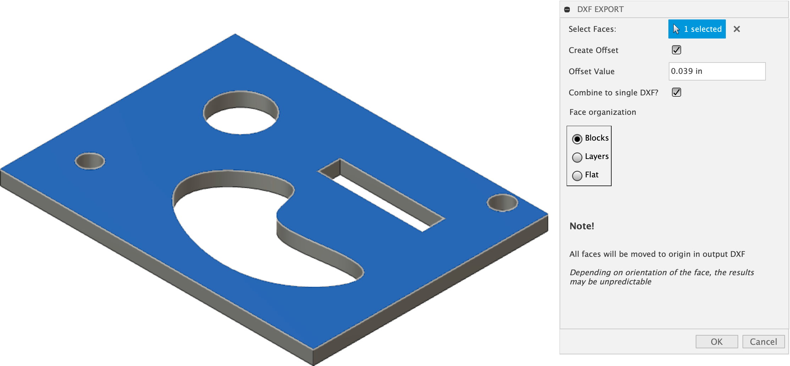

Export2D
========
Export Fusion 360 model faces as PDF or DXF files

Usage
-----
Select multiple faces and export a single or multiple  DXF or PDF files.

Note: All DXF objects will be moved to the orgin based on the face's orientation.
This may give somewhat unpredictable results.
Modification will be likely necessary.

Installation
------------
TODO

Requirements
^^^^^^^^^^^^
Credit where credit is due!!!

This sample add-in is built upon the [ezdxf library](https://github.com/mozman/ezdxf/blob/master/docs/source/introduction.rst)

Licence
-------
`MIT License`_

.. _MIT License: ./LICENSE

Authors
-------
`Export2D` was written by `Patrick Rainsberry <patrick.rainsberry@autodesk.com>`_.

See more useful `Fusion 360 Utilities`_

.. _Fusion 360 Utilities: https://tapnair.github.io/index.html

